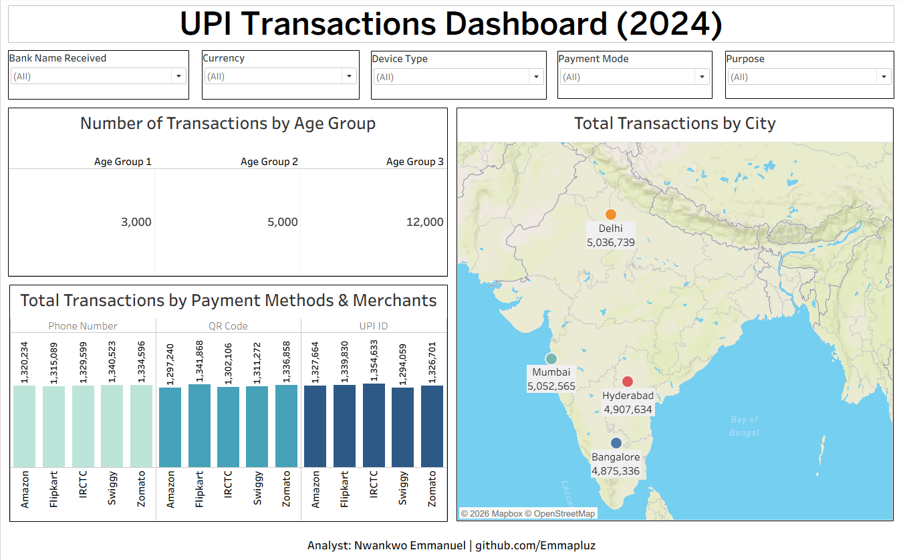

# UPI Transactions — Tableau Dashboard 2 (2024)

**Analyst:** Nwankwo Emmanuel  
**Tool:** Tableau Desktop Public Edition  
**Data:** UPI Transactions Dataset  
**Records:** 20,000 transactions | 2024  
**Portfolio:** [View Portfolio](https://www.notion.so/Emmanuel-Nwankwo-Data-AI-Automation-Portfolio-34d2848d0dba80bd9f6fc5fd419f3c63)  
**Tableau Public:** [View Live Dashboard](your-tableau-public-url)  
**GitHub:** [github.com/Emmapluz](https://github.com/Emmapluz)

---

## Dashboard Preview



---

## Project Overview

An interactive Tableau dashboard built on 
20,000 UPI digital payment transactions 
across four Indian cities in 2024. Features 
five cross-dataset filters, a geographic 
map showing transaction values by city, 
a grouped bar chart analysing transactions 
by payment method and merchant, and card 
visuals showing transactions by age group.

This is the second Tableau dashboard in 
my portfolio, which is built on the same UPI 
dataset previously analysed in Power BI, 
demonstrating how the same data tells 
different stories across different tools.

---

## Visuals Built

| Visual | Type | Insight |
|---|---|---|
| Transactions by Age Group | Card | Age Group 3 leads at 12,000 |
| Transactions by City | Map | Delhi and Mumbai lead |
| Transactions by Payment Method & Merchant | Grouped Bar | Even distribution across methods |

---

## Filters Applied
```
All five filters applied to all worksheets:
→ Bank Name Received
→ Currency
→ Device Type
→ Payment Mode
→ Purpose
```

---

## Key Findings

**Finding 1 — Age Group 3 dominates**
Customers aged 36+ make 12,000 
transactions, which is 4x more than 
Age Group 1 (under 25) at 3,000.

**Finding 2 — Delhi leads transaction value**
₹5,036,739 — slightly ahead of 
Mumbai at ₹5,052,565 though 
effectively equal distribution 
across all four cities.

**Finding 3 — Payment methods evenly distributed**
Phone Number, QR Code and UPI ID 
show near-identical transaction 
volumes across all five merchants, and 
no single method dominates.

**Finding 4 — Merchants equally preferred**
Amazon, Flipkart, IRCTC, Swiggy 
and Zomato all show similar 
transaction volumes, and no single 
merchant dominates across any 
payment method.

---

## Tableau Features Used
```
✅ Map visual with city markers
✅ Grouped bar chart
✅ Card visuals
✅ Five cross-dataset filters
✅ Dashboard assembly
✅ Attribution text object
✅ Published to Tableau Public
```

---

## Same Dataset — Different Tool

This dashboard uses the same UPI 
Transactions dataset previously 
analysed in Power BI:

[Power BI UPI Dashboard](https://github.com/Emmapluz/upi-transactions-powerbi-dashboard)

Comparing both projects shows how 
Tableau and Power BI approach the 
same data differently — different 
visual strengths, different 
interaction models.

---

## Related Projects

| Project | Tool | Link |
|---|---|---|
| Superstore Sales Dashboard | Tableau | [View](https://github.com/Emmapluz/superstore-tableau-dashboard) |
| UPI Transactions | Power BI | [View](https://github.com/Emmapluz/upi-transactions-powerbi-dashboard) |
| Prism Insurance | Power BI + Python | [View](https://github.com/Emmapluz/prism-insurance-powerbi-dashboard) |
| ElectroHub Sales | Power BI | [View](https://github.com/Emmapluz/electrohub-powerbi-sales-dashboard) |
| Dangote Cement Financials | Excel | [View](https://github.com/Emmapluz/dangote-cement-financial-analysis) |
| Nigeria Health EDA | Python | [View](https://github.com/Emmapluz/nigeria-health-analysis) |

---

## About the Analyst

Health educator transitioning into data 
analysis and AI automation. Background 
in health education (B.Ed., University 
of Uyo) and fintech operations 
(Moniepoint Microfinance Bank).

Certified Financial Analyst — 365 Careers, Udemy (December 2025)

- 📍 Lagos, Nigeria
- 💼 [LinkedIn](https://www.linkedin.com/in/emmanuel-uchenna-nwankwo)
- 🗂️ [Portfolio](https://www.notion.so/Emmanuel-Nwankwo-Data-AI-Automation-Portfolio-34d2848d0dba80bd9f6fc5fd419f3c63)
- 💻 [GitHub](https://github.com/Emmapluz)
- 📖 [Medium](https://medium.com/@e.u.nwankwo93)
